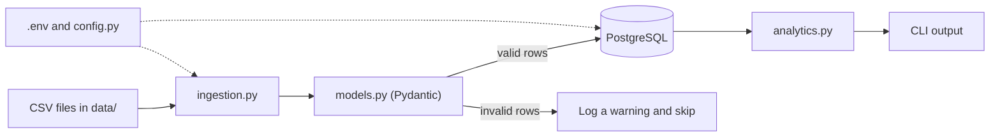

# Expense Processor

A command-line application that loads expense CSV files into PostgreSQL,
validates every row with Pydantic, and runs SQL analytics. The whole system
runs in Docker with a single command.

## Architecture overview



### Project structure

```
Expense-processor/
├── src/expense_processing/
│   ├── main.py             # CLI entry point (ingest, analytics)
│   ├── config.py           # reads settings from .env
│   ├── logging_config.py   # configurable logging
│   ├── models.py           # Pydantic Expense model (validation rules)
│   ├── db.py               # PostgreSQL connection
│   ├── ingestion.py        # reads CSVs, validates, inserts
│   └── analytics.py        # SQL reports
├── sql/
│   ├── schema.sql          # creates the expenses table
│   └── analytics_queries.sql
├── data/                   # sample CSV files
├── tests/                  # pytest tests
├── Dockerfile
├── docker-compose.yml
└── .env.example
```

## Data flow

CSV → validation → database → analytics

1. **CSV:** `ingest` finds every `.csv` file in the data folder.
2. **Validation:** each row is checked by the Pydantic `Expense` model
   (positive amount, real date, non-empty category). Invalid rows are logged
   as warnings and skipped, so one bad row never stops the run.
3. **Database:** valid rows are inserted into PostgreSQL. A `UNIQUE`
   constraint plus `ON CONFLICT DO NOTHING` means running ingestion twice
   does not create duplicates.
4. **Analytics:** the `analytics` command runs SQL reports (totals and
   averages per category, monthly totals, top expenses) and prints the result.

## Setup and run instructions

### Option A: Docker (recommended, one command)

Requires Docker Desktop (or Docker Engine with Compose).

```bash
git clone https://github.com/abhinav23055/Expense-processor.git
cd Expense-processor
cp .env.example .env          # Windows PowerShell: Copy-Item .env.example .env
docker compose up --build
```

This starts PostgreSQL, creates the `expenses` table from `sql/schema.sql`,
waits for the database to be healthy, then runs the app, which ingests every
CSV in `data/` and exits. The database keeps running.

Run analytics reports against the loaded data:

```bash
docker compose run --rm app analytics --report by-category
docker compose run --rm app analytics --report monthly
docker compose run --rm app analytics --report top-expenses
```

Ingest again (safe to repeat, duplicates are skipped):

```bash
docker compose run --rm app ingest
```

Stop everything and delete the stored data:

```bash
docker compose down -v
```

### Option B: Local (Python on your machine, database in Docker)

Requires [uv](https://docs.astral.sh/uv/), which installs the Python version
the project needs, plus Docker for the database.

```bash
uv sync
cp .env.example .env          # keep POSTGRES_HOST=localhost
docker compose up -d db
uv run expense-processing ingest
uv run expense-processing analytics --report monthly
uv run pytest -v              # tests need no database
```

### Configuration (.env)

| Variable | Purpose | Default in `.env.example` |
|---|---|---|
| `POSTGRES_USER` | database user | `expense_user` |
| `POSTGRES_PASSWORD` | database password | `change_me` |
| `POSTGRES_DB` | database name | `expenses` |
| `POSTGRES_HOST` | `localhost` locally, `db` inside Docker (set automatically) | `localhost` |
| `POSTGRES_PORT` | database port | `5432` |
| `LOG_LEVEL` | `DEBUG`, `INFO`, `WARNING`, or `ERROR` | `INFO` |
| `DATA_FOLDER` | folder scanned for CSV files | `data` |

The real `.env` is git-ignored. Only `.env.example` is committed.

### Troubleshooting

If port 5432 is already used by another PostgreSQL on your machine, either
stop that service or change the left side of `"5432:5432"` in
`docker-compose.yml` (for example `"5433:5432"`) and set `POSTGRES_PORT=5433`
in `.env` for local runs.

## Sample outputs

### Ingestion log (first run on an empty database)

```
2026-10-08 06:41:51,279 | INFO | expense_processing.ingestion | Found 2 CSV file(s) in data
2026-10-08 06:41:51,343 | INFO | expense_processing.ingestion | Processing expenses_feb.csv
2026-10-08 06:41:51,346 | WARNING | expense_processing.ingestion | expenses_feb.csv line 10 skipped (amount): Input should be a valid decimal
2026-10-08 06:41:51,401 | INFO | expense_processing.ingestion | expenses_feb.csv done: 8 inserted, 0 duplicates, 1 invalid
2026-10-08 06:41:51,402 | INFO | expense_processing.ingestion | Processing expenses_jan.csv
2026-10-08 06:41:51,404 | WARNING | expense_processing.ingestion | expenses_jan.csv line 10 skipped (amount): Input should be greater than 0
2026-10-08 06:41:51,404 | WARNING | expense_processing.ingestion | expenses_jan.csv line 11 skipped (category): Value error, Category cannot be empty
2026-10-08 06:41:51,404 | WARNING | expense_processing.ingestion | expenses_jan.csv line 12 skipped (expense_date): Input should be a valid date or datetime, month value is outside expected range of 1-12
2026-10-08 06:41:51,411 | INFO | expense_processing.ingestion | expenses_jan.csv done: 7 inserted, 1 duplicates, 3 invalid
2026-10-08 06:41:51,412 | INFO | expense_processing.ingestion | All files done: {'inserted': 15, 'duplicates': 1, 'invalid': 4}
```

The sample data deliberately contains bad rows (negative amount, empty
category, impossible date, non-numeric amount) and one expense that appears in
both files, so every validation rule and the duplicate handling are exercised.

### Ingestion log (second run, same files)

```
2026-10-07 22:13:51,857 | INFO | expense_processing.ingestion | expenses_feb.csv done: 0 inserted, 8 duplicates, 1 invalid
2026-10-07 22:13:51,869 | INFO | expense_processing.ingestion | expenses_jan.csv done: 0 inserted, 8 duplicates, 3 invalid
2026-10-07 22:13:51,869 | INFO | expense_processing.ingestion | All files done: {'inserted': 0, 'duplicates': 16, 'invalid': 4}
```

Nothing new is inserted, which shows ingestion is safe to repeat.

### Analytics: spending per category (`--report by-category`)

```
category      | num_expenses | total_spent | average_spent
--------------+--------------+-------------+--------------
Shopping      | 2            | 5699.00     | 2849.50
Food          | 6            | 4201.25     | 700.21
Entertainment | 2            | 4100.00     | 2050.00
Utilities     | 2            | 2799.00     | 1399.50
Transport     | 3            | 1780.00     | 593.33
```

Uses `SUM`, `AVG`, `COUNT`, `GROUP BY`, and `ORDER BY`.

### Analytics: spending per month (`--report monthly`)

```
month      | num_expenses | total_spent | average_spent
-----------+--------------+-------------+--------------
2026-01-01 | 8            | 8629.50     | 1078.69
2026-02-01 | 7            | 9949.75     | 1421.39
```

Date-based analytics using `DATE_TRUNC('month', expense_date)`.

### Analytics: five largest expenses (`--report top-expenses`)

```
expense_date | category      | description      | amount
-------------+---------------+------------------+--------
2026-02-14   | Entertainment | Concert tickets  | 3500.00
2026-02-22   | Shopping      | Running shoes    | 3200.00
2026-01-20   | Shopping      | Winter jacket    | 2499.00
2026-01-12   | Utilities     | Electricity bill | 1800.00
2026-02-18   | Food          | Groceries        | 1420.75
```

The same queries are saved in `sql/analytics_queries.sql`.

## Testing

```bash
uv run pytest -v
```

There are 10 tests, and none need a database:

- `tests/test_models.py`: the Pydantic model accepts a valid row, rejects a
  negative amount, a non-numeric amount, an empty category and an impossible
  date, and fills in defaults for optional fields.
- `tests/test_ingestion.py`: CSV files are read, valid rows are returned, and
  invalid rows are skipped and counted.
- `tests/test_analytics.py`: the expected reports exist and are read-only
  `SELECT` queries.

## Logging

Logging is configured in `src/expense_processing/logging_config.py`. The
level comes from `LOG_LEVEL` in `.env` (`DEBUG`, `INFO`, `WARNING` or
`ERROR`), so verbosity can be changed without touching the code.

## Git workflow

`main` is the stable branch. After the initial project setup, every piece of
work was developed on its own short-lived feature branch and merged into
`main` through a pull request:

| Branch | Contents |
|---|---|
| `feature/project-structure` | folders, `.env.example`, `.gitignore` |
| `feature/db-schema` | `schema.sql`, sample CSVs, PostgreSQL in docker-compose |
| `feature/validation` | Pydantic `Expense` model and its tests |
| `feature/ingestion` | config, logging, database connection, CSV ingestion |
| `feature/cli` | `ingest` command |
| `feature/analytics` | SQL reports and the `analytics` command |
| `feature/dockerize-app` | `Dockerfile` and the `app` service |
| `feature/tests` | ingestion and analytics tests |
| `docs/readme` | this README |

Commits are small and describe one change each. Secrets are never committed:
`.env` is git-ignored and `.env.example` holds placeholders only.

## Assumptions

- **Duplicates:** rows identical in date, category, description, amount and
  payment method are treated as the same expense (enforced by a `UNIQUE`
  constraint and `ON CONFLICT DO NOTHING`). Two genuinely separate identical
  purchases on the same day would be stored once.
- **Optional fields:** `description` and `payment_method` default to an empty
  string instead of NULL. PostgreSQL treats NULLs as distinct inside a
  `UNIQUE` constraint, so NULLs would let duplicates through.
- **Categories** are normalised to Title Case (`food` becomes `Food`), so
  `food` and `FOOD` are not counted as different categories.
- **Money** is stored as `NUMERIC(10, 2)` in a single currency, never as a
  float.
- **CSV format:** UTF-8, with a header row using the column names
  `expense_date,category,description,amount,payment_method`, and dates in
  `YYYY-MM-DD` format.
- **Invalid rows** are logged and skipped. They are not stored anywhere.
- **Processing order:** files in the data folder are processed in
  alphabetical