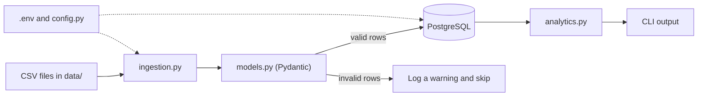

# Expense Processor

A command-line application that loads expense CSV files into PostgreSQL,
validates every row with Pydantic, and runs SQL analytics. The whole system
runs in Docker with a single command.

## Architecture overview



### Project structure

```
Expense-processor/
├── src/expense_processing/
│   ├── main.py             # CLI entry point (ingest, analytics)
│   ├── config.py           # reads settings from .env
│   ├── logging_config.py   # configurable logging
│   ├── models.py           # Pydantic Expense model (validation rules)
│   ├── db.py               # PostgreSQL connection
│   ├── ingestion.py        # reads CSVs, validates, inserts
│   └── analytics.py        # SQL reports
├── sql/
│   ├── schema.sql          # creates the expenses table
│   └── analytics_queries.sql
├── data/                   # sample CSV files
├── tests/                  # pytest tests
├── Dockerfile
├── docker-compose.yml
└── .env.example
```

## Data flow

CSV → validation → database → analytics

1. **CSV:** `ingest` finds every `.csv` file in the data folder.
2. **Validation:** each row is checked by the Pydantic `Expense` model
   (positive amount, real date, non-empty category). Invalid rows are logged
   as warnings and skipped, so one bad row never stops the run.
3. **Database:** valid rows are inserted into PostgreSQL. A `UNIQUE`
   constraint plus `ON CONFLICT DO NOTHING` means running ingestion twice
   does not create duplicates.
4. **Analytics:** the `analytics` command runs SQL reports (totals and
   averages per category, monthly totals, top expenses) and prints the result.