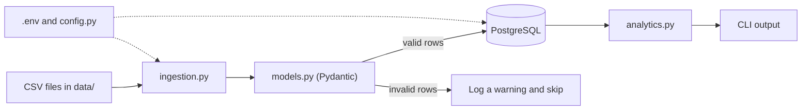

# Expense Processor

A command-line application that loads expense CSV files into PostgreSQL,
validates every row with Pydantic, and runs SQL analytics. The whole system
runs in Docker with a single command.

## Architecture overview



### Project structure

```
Expense-processor/
├── src/expense_processing/
│   ├── main.py             # CLI entry point (ingest, analytics)
│   ├── config.py           # reads settings from .env
│   ├── logging_config.py   # configurable logging
│   ├── models.py           # Pydantic Expense model (validation rules)
│   ├── db.py               # PostgreSQL connection
│   ├── ingestion.py        # reads CSVs, validates, inserts
│   └── analytics.py        # SQL reports
├── sql/
│   ├── schema.sql          # creates the expenses table
│   └── analytics_queries.sql
├── data/                   # sample CSV files
├── tests/                  # pytest tests
├── Dockerfile
├── docker-compose.yml
└── .env.example
```

## Data flow

CSV → validation → database → analytics

1. **CSV:** `ingest` finds every `.csv` file in the data folder.
2. **Validation:** each row is checked by the Pydantic `Expense` model
   (positive amount, real date, non-empty category). Invalid rows are logged
   as warnings and skipped, so one bad row never stops the run.
3. **Database:** valid rows are inserted into PostgreSQL. A `UNIQUE`
   constraint plus `ON CONFLICT DO NOTHING` means running ingestion twice
   does not create duplicates.
4. **Analytics:** the `analytics` command runs SQL reports (totals and
   averages per category, monthly totals, top expenses) and prints the result.

## Setup and run instructions

### Option A: Docker (recommended, one command)

Requires Docker Desktop (or Docker Engine with Compose).

```bash
git clone https://github.com/abhinav23055/Expense-processor.git
cd Expense-processor
cp .env.example .env          # Windows PowerShell: Copy-Item .env.example .env
docker compose up --build
```

This starts PostgreSQL, creates the `expenses` table from `sql/schema.sql`,
waits for the database to be healthy, then runs the app, which ingests every
CSV in `data/` and exits. The database keeps running.

Run analytics reports against the loaded data:

```bash
docker compose run --rm app analytics --report by-category
docker compose run --rm app analytics --report monthly
docker compose run --rm app analytics --report top-expenses
```

Ingest again (safe to repeat, duplicates are skipped):

```bash
docker compose run --rm app ingest
```

Stop everything and delete the stored data:

```bash
docker compose down -v
```

### Option B: Local (Python on your machine, database in Docker)

Requires [uv](https://docs.astral.sh/uv/), which installs the Python version
the project needs, plus Docker for the database.

```bash
uv sync
cp .env.example .env          # keep POSTGRES_HOST=localhost
docker compose up -d db
uv run expense-processing ingest
uv run expense-processing analytics --report monthly
uv run pytest -v              # tests need no database
```

### Configuration (.env)

| Variable | Purpose | Default in `.env.example` |
|---|---|---|
| `POSTGRES_USER` | database user | `expense_user` |
| `POSTGRES_PASSWORD` | database password | `change_me` |
| `POSTGRES_DB` | database name | `expenses` |
| `POSTGRES_HOST` | `localhost` locally, `db` inside Docker (set automatically) | `localhost` |
| `POSTGRES_PORT` | database port | `5432` |
| `LOG_LEVEL` | `DEBUG`, `INFO`, `WARNING`, or `ERROR` | `INFO` |
| `DATA_FOLDER` | folder scanned for CSV files | `data` |

The real `.env` is git-ignored. Only `.env.example` is committed.

### Troubleshooting

If port 5432 is already used by another PostgreSQL on your machine, either
stop that service or change the left side of `"5432:5432"` in
`docker-compose.yml` (for example `"5433:5432"`) and set `POSTGRES_PORT=5433`
in `.env` for local runs.