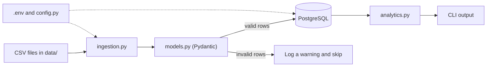

# Architecture diagram

```mermaid
flowchart LR
    CSV["CSV files in data/"] --> ING["ingestion.py"]
    ING --> VAL["models.py (Pydantic)"]
    VAL -->|valid rows| DB[("PostgreSQL")]
    VAL -->|invalid rows| LOG["Log a warning and skip"]
    DB --> ANA["analytics.py"]
    ANA --> OUT["CLI output"]
    CFG[".env and config.py"] -.-> ING
    CFG -.-> DB
```